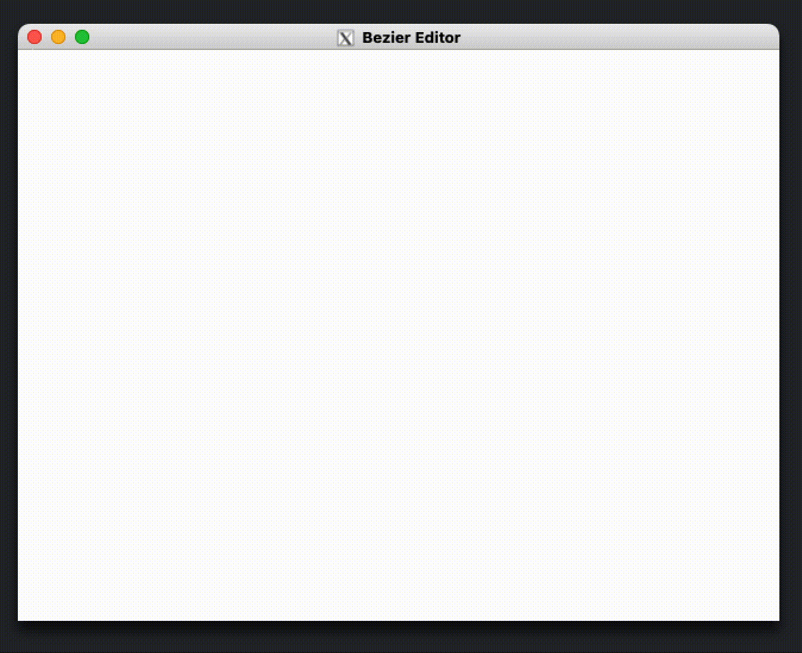

# Bezier-x86
This is an interactive Bezier curve editor written in x86 assembly and C

> The delay is caused by the SSH connection (my local machine works on ARM architecture :/ )

Requirements:
- OPEN GL ( apt-get install libgl1-mesa-dev)
- GLUT
